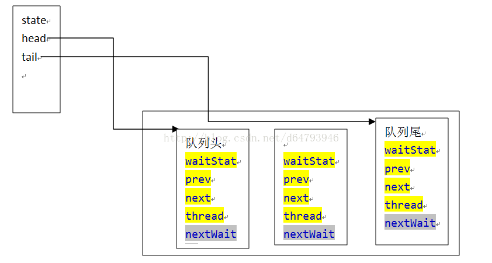

# AQS的原理解析
## 简介
java中实现线程同步有synchronized和ReentrantLock方法，当然还有其他的方法。synchronized是使用`monitorenter`和`monitorexit`指令来同步代码块。而ReentrantLock是底层依赖AQS(AbstractQueuedSynchronizer)组件来实现的，即非阻塞同步队列。AQS相比于monitor可以实现多种同步方式，比如独占锁，共享锁，条件队列，公平锁等模式。在并发效率上，synchronized有自旋锁，偏向锁，轻量级锁，重量级锁的优化后，效率和ReentrantLock是差不多的。但是在同步的模式上只能是独占锁。
<!-- more -->
AQS使用CAS机制和用volatile的state值来记录获取锁，竞争锁，释放锁的操作。**AQS不关心如何挂起线程，AQS是判断资源是否能被访问，当线程不能被访问时对线程加入队列，挂起和唤醒等操作。** 

可以思考如下的问题

1. 线程如何访问AQS维护的资源
2. 当资源不可访问时，当前的线程如何挂起 
3. 当线程提前被中断或者其他原因退出访问资源，如何从AQS队列中退出

我们在使用时，**AQS主要的功能有独占锁和共享锁**。在实现了AQS的子类中，一般只会使用其中的一种。比如ReentrantLock实现了独占锁，CountDownLatch和Semphere实现了共享锁。

## AQS的数据结构
AQS维护了一个volatile int state(共享资源)和一个FIFO非阻塞等待队列来实现的。
### node节点
node节点的代码如下所示，

```java
static final class Node {
        // 共享锁模式
        static final Node SHARED = new Node();
        // 独占锁模式
        static final Node EXCLUSIVE = null;
        static final int CANCELLED =  1;
        static final int SIGNAL    = -1;
        static final int CONDITION = -2;
        static final int PROPAGATE = -3;
        /**     
        * CANCELLED，值为1，表示当前的线程被取消     
        * SIGNAL，值为-1，表示当前节点的后继节点包含的线程需要运行，也就是unpark；     
        * CONDITION，值为-2，表示当前节点在等待condition，也就是在condition队列中；           
        * PROPAGATE，值为-3，表示当前场景下后续的acquireShared能够得以执行；     
        * 值为0，表示当前节点在sync队列中，等待着获取锁。     */
        // 线程的等待状态
        volatile int waitStatus;
        //前驱节点
        volatile Node prev;
        //后继节点
        volatile Node next;
        //该节点的线程
        volatile Thread thread;
        // 存储condition队列中的后继节点
        Node nextWaiter;
        //是否是共享模式
        final boolean isShared() {
            return nextWaiter == SHARED;
        }
        // 获取前驱节点
        final Node predecessor() throws NullPointerException {
            Node p = prev;
            if (p == null)
                throw new NullPointerException();
            else
                return p;
        }

        Node() {    
        }
        // Used by addWaiter 
        Node(Thread thread, Node mode) {     
            this.nextWaiter = mode;
            this.thread = thread;
        }
        // Used by Condition
        Node(Thread thread, int waitStatus) { 
            this.waitStatus = waitStatus;
            this.thread = thread;
        }
    }
```


在node类中有prev和next，看出AQS的同步队列是双向队列。有thread来指向当前线程，nextWaiter 如果当前的节点时共享模式，值指向一个SHARE节点。当前节点是条件队列中，值会指向下一个等待条件的节点。waitstatus表示当前节点的状态，值如下所示。

1. -1 SIGNAL 当前节点的后继节点被阻塞，当前节点被释放后要唤醒后继节点
2. 1 CANCELLED 当前节点超时或者中断被取消，唯一大于0的值
3. -2 CONDITION 当前节点处于条件队列中，条件没达成不能获取锁
4. -3 PROPAGATE 当前节点处于传播模式，共享锁模式使用该值
5. 0 无 节点初始状态，head初始化条件队列时使用

在独占锁模式下的同步队列结构如下：


head节点存储的是new出来的节点，它的waitStatus的值为0，tail指向队列的最后一个节点。

共享锁的同步队列如下：

共享锁和独占锁时使用同一个同步队列，队列中的节点可以是共享类型也可以是独占类型。
除了以上的同步队列，还有一个条件队列入地下所示。

使用的也是Node节点，是一个单向队列，用nextWaiter来指向下一个节点。

### CAS操作
AQS中有3个重要的变量,head、tail、state都是volatile类型的，保证了可见性。

```java
// 队头结点    
private transient volatile Node head;     
// 队尾结点    
private transient volatile Node tail;     
// 代表共享资源    
private volatile int state;     
protected final int getState() {        
    return state;    
}     
protected final void setState(int newState) {        
    state = newState;    
}     
//CAS操作，当stateoffset的内存的值state和expect相等时将内存的值设为update
protected final boolean compareAndSetState(int expect, int update) {        
    return unsafe.compareAndSwapInt(this,stateOffset, expect, update);    
}
```
## 源码解读
AQS定义了两种的资源共享方式

1. Exclusive 独占锁模式，只有一个线程能执行，ReentrantLock
2. Share 共享锁模式 多个线程可以同时执行，CountDownLatch/Semaphore

## AQS独占锁模式
一般情况下，ReentrantLock的释放方式为

```java
reentrantLock.lock();
//do something
reentrantlock.unlock();
```
ReentrantLock保证了在同一时刻只有一个线程能获取到锁，其余的线程都要挂起等待，**直到拥有锁的线程释放了锁，被挂起的线程被唤醒重新竞争锁。**
ReentrantLock的加锁都是由AQS完成的，它只是初始化了AQS的state资源的数量和获取资源。ReentrantLock分为公平锁和非公平锁。

### 获取独占锁
获取独占锁的流程如下所示

结合ReentrantLock的源码分析
ReentrantLock 的构造函数中是初始化sync = new NonfairSync()，其中NonfairSync继承Sync，Sync继承了AQS

```java
public ReentrantLock() {
    sync = new NonfairSync(); //构造一个syn
}
```

ReentrantLock.lock得到获取锁的入口函数，调用sync.lock()

```java
public void lock() {
    sync.lock();
}
```

公平锁和非公平锁将lock方法重写了，根据不同的sync调用不同的lock

```java
//非公平锁
final void lock() {
    //用CAS修改state，如果state为0 设置为1 表示当前线程获取锁
    if (compareAndSetState(0, 1))               
        setExclusiveOwnerThread(Thread.currentThread()); //当前线程设置为独占锁
    else
        acquire(1); //尝试获取锁
}t

//公平锁
final void lock() {
    acquire(1);
}
```
**如果state为0，说明没有线程获取锁，可以设置当前线程获取独占锁，当前线程不加入队列，如果state为1，表示有线程占用资源，需要调用acquire()去获取锁**

```java
abstract static class Sync extends AbstractQueuedSynchronizer {}
static final class NonfairSync extends Sync {}
static final class FairSync extends Sync {}
```
* 公平锁 每个线程强占锁的顺序是先后调用lock方法的顺序，并依次获取锁。
* 非公平锁 每个线程强占锁的顺序不变，和调用lock方法的先后顺序无关。
**公平还是非公平是在获取锁的时候是直接获取锁还是先去队列中排队。**

#### acquire()方法

```java
public final void acquire(int arg) {
    //tryAcquire子类重写，不同的获取资源逻辑
    //addWaiter是将节点加入到队列的tail     
    //acquireQueued是不断循环，中断线程 
    if (!tryAcquire(arg) &&    
        acquireQueued(addWaiter(Node.EXCLUSIVE), arg)) 
            selfInterrupt();
}
```
#### tryAcquire()方法
tryAcquire()方法AQS并没有实现，具体的实现方法留给子类去实现了。从方法里可以看到当state为0表示没有线程占用锁，当state > 0 表示了线程占用，并且记录了重复进入的次数。state的更新采用CAS技术。
同时，公平锁和非公平锁的实现也体现出来了。非公平锁是唤醒的线程均去尝试设置state。而非公平锁会只有同步队列的head节点的next节点才能去设置state。说明公平锁是按照FIFO队列中的顺序获取锁。

```java
//如果是非公平锁，调用nonfairAcquire()
final boolean nonfairTryAcquire(int acquires) {
    //得到当前的线程
    final Thread current = Thread.currentThread(); 
    //得到lock的state状态
    int c = getState(); 
    //没有线程占用锁
    if (c == 0) { 
        //当前线程直接去抢占锁
        if (compareAndSetState(0, acquires)) {  
            //当前线程获取锁，设置为独占锁
            setExclusiveOwnerThread(current); 
            return true;
        }
    }
    //当前线程再次获取锁，锁可以重入 则state加1
    else if (current == getExclusiveOwnerThread()) { 
        int nextc = c + acquires;
        if (nextc < 0) // overflow
            throw new Error("Maximum lock count exceeded");
        setState(nextc);
        return true;
    }
    return false;
}

//如果是公平锁，调用
protected final boolean tryAcquire(int acquires) {
    final Thread current = Thread.currentThread();
    int c = getState();
    if (c == 0) {
        //当前线程要排序再获取锁。当前线程是head节点的next节点并且当前节点设置state为1 则获取锁成功
        if (!hasQueuedPredecessors() &&   
            compareAndSetState(0, acquires)) {
            setExclusiveOwnerThread(current);
            return true;
        }
    }
    else if (current == getExclusiveOwnerThread()) {
        int nextc = c + acquires;
        if (nextc < 0)
            throw new Error("Maximum lock count exceeded");
        setState(nextc);
        return true;
    }
    return false;
}


// 判断当前的线程是不是head的下一个节点   按顺序唤醒
public final boolean hasQueuedPredecessors() {
    Node t = tail; 
    Node h = head;
    Node s;
    //head的节点是一个哨兵节点 不保存节点信息
    //s=head.next节点并且s的线程不是当前线程 也就是说head节点的next节点不是当前节点
    return h != t && ((s = h.next) == null || s.thread != Thread.currentThread()); 
}
```
#### 入队列操作 acquireQueued(addWaiter(Node.EXCLUSIVE))
当tryAcquire()方法返回false，表示锁被线程占用并且不是当前线程，无法重入。需要将当前线程入队列并且将线程挂起。

```java
//这个方法是将当前的线程加入到阻塞队列中
//每次都先尝试快速入队，如果失败了 再调用enq自旋入队
private Node addWaiter(Node mode) {
    Node node = new Node(Thread.currentThread(), mode);
    // Try the fast path of enq; backup to full enq on failure
    //尝试快速入队，没有竞争条件肯定成功，如果失败进入enq自旋重复入队
    Node pred = tail;
    if (pred != null) {
        node.prev = pred;
        if (compareAndSetTail(pred, node)) { //如果pred和tail的元素一样，则说明没有其他线程改变tail 可以插入  
            pred.next = node; 
            return node;    //插入成功，直接返回
        }
    }
    enq(node);  //自旋入队
    return node;
}

//自旋入队
private Node enq(final Node node) {
    for (;;) {
        Node t = tail;
        if (t == null) { // Must initialize
            if (compareAndSetHead(new Node())) //队列中没有元素，new一个Node作为哨兵节点 即head=new Node() tail = head
                tail = head;
        } else {
            node.prev = t;  //node指向tail
            if (compareAndSetTail(t, node)) {  //当t没有被修改，CAS修改tail
                t.next = node;
                return t; //返回tail节点
            }
        }
    }
}

//acquiredQueued主要是将线程挂起，等待唤醒   每次唤醒都是唤醒head节点的下一个节点   head节点为获得锁的节点
//如果当前节点是head节点的下一个节点，并且成功获得锁就唤醒，然后将head节点也就是释放锁的节点移除队列，next节点变成head节点，准备下一次唤醒next节点
final boolean acquireQueued(final Node node, int arg) {
    boolean failed = true;
    try {
        boolean interrupted = false;
        for (;;) {   //一直循环
            //获取当前节点的前驱结点
            final Node p = node.predecessor();  
           //问题：为什么是前驱节点而不是当前节点？因为我们队列在初始化时候生成了个虚拟头节点，相当于多出来了个节点。 
            if (p == head && tryAcquire(arg)) {    
                //前驱结点为head节点并且尝试获取锁成功，则将当前节点设置为头节点并且放回  
                //head节点的线程为获取到锁的线程，head节点的next节点为阻塞等待的线程 
                setHead(node);      
                p.next = null;   // help GC
                failed = false;
                return interrupted;
            }
            //判断当前线程是不是应该挂起 如果应该挂起则挂起，等待release唤醒释放
            //如果不挂起，那么线程在for循环里面一直抢占cpu
            //当阻塞后被唤醒了就继续循环
            if (shouldParkAfterFailedAcquire(p, node) &&
                parkAndCheckInterrupt())   
                interrupted = true;
        }
    } finally {
        if (failed)
            cancelAcquire(node);
    }
}

//使用park方法方法将线程挂起 同时唤醒和中断都可以导致线程醒来，判断线程的中断标志位
private final boolean parkAndCheckInterrupt() {
    //调用这个方法阻塞线程，最终调用Unsafe.park(false, 0L)这个是native方法
    LockSupport.park(this);  
    //检查线程的中断状态
    return Thread.interrupted(); 
}

//判断当前节点是不是应该挂起  因为每次都是由node节点的pre节点来判断是不是要挂起  
//当pre节点被取消了，就将该节点移出阻塞队列
private static boolean shouldParkAfterFailedAcquire(Node pred, Node node) {
    int ws = pred.waitStatus;
    if (ws == Node.SIGNAL)   //唤醒下一个节点
        return true;
    if (ws > 0) {  //pre节点被取消了 
        
        do { 
            node.prev = pred = pred.prev;  //node节点指向pre节点的pre节点，相当于把取消的节点从队列中移除
        } while (pred.waitStatus > 0); //将所有的waitstatus的节点都从队列中去除
        pred.next = node;
    } else {
        /*
        * waitStatus must be 0 or PROPAGATE.  Indicate that we
        * need a signal, but don't park yet.  Caller will need to
        * retry to make sure it cannot acquire before parking.
        */
        compareAndSetWaitStatus(pred, ws, Node.SIGNAL);   //将pre节点设置为signal
    }
    //将取消的节点剔除出队列后返回false，重新for循环
    return false;
}
```
公平锁和非公平锁的唯一区别是在lock时的处理逻辑不同。

1. 公平锁是在lock时先把当前线程入到FIFO队列中，再去按照顺序获取锁。
2. 非公平锁是在lock时可以不管FIFO队列中是否有等待线程，先去阐释获取一次锁，即CAS操作state，失败了才入FIFO队列，否则直接获得锁。

### 释放独占锁流程
ReentrantLock调用unlock()方法释放独占锁，

```java
public void unlock() {
    sync.release(1);
}
```
具体的流程如下所示。


#### release()释放锁
调用release()方法，内部调用了被子类重写的tryRelease()方法来释放资源。假如资源state释放完毕为0，则当前线程不再占用锁，找到AQS的头结点(**head结点为当前的活动线程，要释放head结点的next节点**)，调用unparkSuccessor()方法释放FIFO队列中第一个等待锁的节点。

```java
public final boolean release(int arg) {
    if (tryRelease(arg)) {  
    //成功将state减去了，就要从的等待队列中唤醒一个线程。 
    //如果是同一个线程，则将锁的计数器state-1，返回false，表示锁还没有释放
        Node h = head;  //从队列里面唤醒一个线程
        if (h != null && h.waitStatus != 0) //waitstatus为-1，要唤醒下一个节点
            unparkSuccessor(h);
        return true;
    }
    return false;
}
```

#### tryRelease()方法
具体由子类重写的该方法来释放state资源。 state - release 如果state还是大于0，说明线程被重入了，则还要占有线程。当tryRelease方法返回true时，说明当前线程已经不占用锁，需要唤醒一个线程来强占锁。具体逻辑为找到head节点的next节点唤醒。

```java
protected final boolean tryRelease(int releases) {
    //计数
    int c = getState() - releases; 
    if (Thread.currentThread() != getExclusiveOwnerThread())
        throw new IllegalMonitorStateException();
    boolean free = false;
    if (c == 0) {
        free = true;
        //释放锁，lock没有线程占用
        setExclusiveOwnerThread(null); 
    }
    setState(c);
    return free;
}
```

#### unparkSuccessor(Node node)唤醒下一个节点
只有node节点的waitStatus为负数(1为cancel),才能唤醒下一个节点。如果next节点被取消了，那么就要从tail节点开始查找，找到FIFO队列中最早没有被取消的节点，唤醒该节点。

```java
private void unparkSuccessor(Node node) {
    int ws = node.waitStatus;
    if (ws < 0)
     //如果状态为负(Signal, Propagate)，那么清除状态为0 
     //如果失败，或者状态被其他线程改变也没有关系
        compareAndSetWaitStatus(node, ws, 0);
 
     //唤醒的节点是head节点的next节点。如果该节点被取消了，
     //那么就从后往前遍历找到最早没有被取消的节点
    Node s = node.next;
    if (s == null || s.waitStatus > 0) {
        s = null;
        for (Node t = tail; t != null && t != node; t = t.prev)
            if (t.waitStatus <= 0)
                s = t;
    }
    if (s != null)
        //唤醒队列中的一个线程
        LockSupport.unpark(s.thread); 
}
```

当调用了LockSupport.unpark(s.thread)方法后，s线程将会被唤醒，重新回到LockSupport.park(this);方法，继续执行。其中shouldParkAfterFailedAcquire()方法会从队列中剔除pre节点被取消的节点。**只有head节点的next节点才能得到锁资源，并被设置成新的head节点。head节点表示当前正在获取锁资源的节点。**

```java
private final boolean parkAndCheckInterrupt() {
    //调用这个方法阻塞线程，最终调用Unsafe.park(false, 0L)这个是native方法
    LockSupport.park(this);  
    //检查线程的中断状态
    return Thread.interrupted(); 
}

private static boolean shouldParkAfterFailedAcquire(Node pred, Node node) {
    int ws = pred.waitStatus;
    if (ws == Node.SIGNAL)   //唤醒下一个节点
        return true;
    if (ws > 0) {  //pre节点被取消了 
        
        do { 
            node.prev = pred = pred.prev;  //node节点指向pre节点的pre节点，相当于把取消的节点从队列中移除
        } while (pred.waitStatus > 0); //将所有的waitstatus的节点都从队列中去除
        pred.next = node;
    } else {
        compareAndSetWaitStatus(pred, ws, Node.SIGNAL);   //将pre节点设置为signal
    }
    //将取消的节点剔除出队列后返回false，重新for循环
    return false;
}
```


### AQS共享锁模式
共享锁的实现方式为CountDownLatch闭锁方式，使一个或者多个线程等待时间的发生。闭锁在new时初始化了state的计数器为一个正值，表示当前正在的事件数量。COuntDown()方法表示一个事件发生了，计数器的值减1.await等待计数器的值为0，表示等待的事件已经发生。如果state不为0，则await会阻塞计数器为0，或者等待线程中断或者等待超时。

#### await等待获取共享锁流程

```java
public void await() throws InterruptedException {
     sync.acquireSharedInterruptibly(1);
}
```
countdownlatch等待获取共享锁的流程如下所示。client调用await()方法，当state不等于0，则线程会被封装成Node加到FIFO等待队列并挂起线程等待被唤醒。


#### acquireSharedInterruptibly(arg)方法

```java
public final void acquireSharedInterruptibly(int arg)
        throws InterruptedException {
     //响应线程的中断，检查线程是否被中断
    if (Thread.interrupted())  
        throw new InterruptedException();
     //返回-1，说明state不为0 也就是CownDownLatch的计数器不为0 
    if (tryAcquireShared(arg) < 0)  //获取共享锁，小于0 表示获取失败
        doAcquireSharedInterruptibly(arg);
}

//CountDownLatch的计数器是否为0   tryAcquire只是判断当前的线程能否获取锁
protected int tryAcquireShared(int acquires) {
     return (getState() == 0) ? 1 : -1;
}
```

#### doAcquireSharedInterruptibly(arg)
该方法是将thread包装成Node，加入到FIFO队列中

```java
private void doAcquireSharedInterruptibly(int arg)
    throws InterruptedException {
     //将当前节点包装成共享节点
     //将node加入到FIFO队列中
    final Node node = addWaiter(Node.SHARED);
    boolean failed = true;
    try {
        for (;;) {
            //一直判断node节点的状态
            final Node p = node.predecessor();
            if (p == head) {
               //如果当前节点是head节点的next节点，说明当前节点是AQS队列中获取锁的第一个节点
               //按照FIFO原则，可以直接尝试获取锁
                int r = tryAcquireShared(arg);
                if (r >= 0) {
                    //如果当前node获取锁成功，就要将当前节点设为AQS第一个节点
                    //AQS队列的第一个节点表示当前已经获取锁的节点
                    setHeadAndPropagate(node, r);
                    p.next = null; // help GC
                    failed = false;
                    return;
                }
            }
               //如果当前节点没有获取到锁，就要检查需要把当前节点挂起
            if (shouldParkAfterFailedAcquire(p, node) &&
                parkAndCheckInterrupt())
                throw new InterruptedException();
        }
    } finally {
        if (failed)
            cancelAcquire(node);
    }
}

//将头节点设置成传播属性
private void setHeadAndPropagate(Node node, int propagate) {
    Node h = head; // Record old head for check below
    setHead(node);

    if (propagate > 0 || h == null || h.waitStatus < 0 ||
            (h = head) == null || h.waitStatus < 0) {
        Node s = node.next;
        if (s == null || s.isShared())
            doReleaseShared(); //每一个成为头节点都要释放下一个节点 
    }
}
```

### 释放共享锁的流程
AQS调用countDown()方法会state减1，当state减为0时，会释放FIFO队列中的所有线程，即共享锁。

#### releaseShared()方法
tryReleaseShared()后如果state=0，则countDownLatch中的所有子线程都执行完毕，要唤醒await的线程，这些线程都在AQS中被挂起。下一步是唤醒AQS的头节点，然后由头节点依次唤醒下一个节点。

```java
public final boolean releaseShared(int arg) {
    if (tryReleaseShared(arg)) { 
        //如果state =0 就唤醒FIFO的队列的线程
        doReleaseShared();
        return true;
    }
    return false;
}

//如果state为0  表示当前线程释放锁，唤醒队列中线程
protected boolean tryReleaseShared(int releases) {
    // Decrement count; signal when transition to zero
    for (; ; ) {
        int c = getState();
        if (c == 0)
            return false;
        int nextc = c - 1;
        if (compareAndSetState(c, nextc))
            return nextc == 0;
    }
}
```

#### AQS的doReleaseShared()方法 唤醒head节点的next节点

```java
private void doReleaseShared() {
    for (; ; ) {
        Node h = head;
        if (h != null && h != tail) {
            int ws = h.waitStatus;
            if (ws == Node.SIGNAL) {
                //如果当前节点是SIGNAL意味着，它正在等待一个信号。
                //或者说，它在等待被唤醒，因此做两件事
                /*重置waitStatus标志位，如果失败则重试*/
                if (!compareAndSetWaitStatus(h, Node.SIGNAL, 0))
                    continue;            // loop to recheck cases

                /*重置成功后,唤醒等待获取共享锁的第一个节点*/
                unparkSuccessor(h);
            } else if (ws == 0 && !compareAndSetWaitStatus(h, 0, Node.PROPAGATE))
                //如果本身头节点的waitStatus是处于重置状态（waitStatus==0）的，将其设置为“传播”状态。
                //意味着需要将状态向后一个节点传播。
                continue;                // loop on failed CAS
        }
        if (h == head)                   // loop if head changed
            break;
    }
}
```
当调用unparkSuccessor()方法唤醒AQS队列的第一个节点时，被唤醒的线程会继续执行doAcquireSharedInterruptibly()方法，如果当前的节点是head节点的next节点，就把该节点设置成新的head节点，然后移除老的head节点。再接着调用doReleaseShared()方法依次唤醒下一个节点。

每一个设置成新的head节点都要调用doReleaseShared()方法区唤醒head节点的next节点。从而实现了共享对象的传播。
```java
private void setHeadAndPropagate(Node node, int propagate) {
    Node h = head; // Record old head for check below
    setHead(node);

    if (propagate > 0 || h == null || h.waitStatus < 0 ||
            (h = head) == null || h.waitStatus < 0) {
        Node s = node.next;
        if (s == null || s.isShared())
            doReleaseShared();
    }
}
```

### 可中断的锁的实现方式
在上面的独占锁和共享锁中，**调用lock()方法均是不可中断的。在调用void lock()方法区获取锁时，如果锁被占用，线程将会阻塞，调用线程的interrupt()方法也不能取消锁。**
当想要等待超时或者中断退出的锁实现时，需要使用lockInterruptibly()方法。LockSupport.park()方法可以响应中断，但是不会抛出InterruptedException的异常。
#### AQS的acquireInterruptibly方法
如果线程被中断了，会抛出InterruptedException()异常。

```java
public final void acquireInterruptibly(int arg)
            throws InterruptedException {
    if (Thread.interrupted())
        throw new InterruptedException();
    if (!tryAcquire(arg))
        doAcquireInterruptibly(arg);   // @1
}
```

#### doAcquireInterruptibly()方法
从这段代码就看出来了lock从中断退出的。
当线程被中断了，读取Thread.Interruped()方法为true，表示线程被中断了，就抛出异常，从for循环中退出。在最外面捕获异常后调用cancelAcquire(node)方法将节点取消。

```java
private void doAcquireInterruptibly(int arg)
        throws InterruptedException {
    final Node node = addWaiter(Node.EXCLUSIVE);   // @1
    boolean failed = true;
    try {
        for (;;) {
            final Node p = node.predecessor();
            if (p == head && tryAcquire(arg)) {              // @2
                setHead(node);
                p.next = null; // help GC
                failed = false;
                return;
            }
            if (shouldParkAfterFailedAcquire(p, node) &&
                parkAndCheckInterrupt())
                throw new InterruptedException();   //@3
        }
    } finally {
        if (failed)
            cancelAcquire(node); //@4
    }
}

```

#### cancelAcquire()方法
取消节点的步骤如下

1. 从node出发找到一个未被取消的prev节点，并移除中间的取消节点。
3. 如果node是tail节点，就调用CAS将prev设置为tail节点。如果CAS失败，表示有其他线程设置了tail节点，结束
4. 如果node节点不是tail节点，那么就要将node从队列中移除。prev.next = node.next是否能操作的逻辑是prev不是head节点，prev.waitStatus是Signal或者设置waitStatus的类型为signal成功并且node.next节点是非取消的，则可以将node节点移除。
5. 如果prev为head节点，那么执行一次唤醒操作。

```java
private void cancelAcquire(Node node) {
        if (node == null)
            return;
 
        node.thread = null;
        Node pred = node.prev;   
        while (pred.waitStatus > 0)  // @1
            node.prev = pred = pred.prev;
 
        Node predNext = pred.next; //@2
        node.waitStatus = Node.CANCELLED; 
 
        if (node == tail && compareAndSetTail(node, pred)) {   // @3 
            compareAndSetNext(pred, predNext, null);
        } else {  // @4
            int ws;
            if (pred != head &&
                ((ws = pred.waitStatus) == Node.SIGNAL ||
                 (ws <= 0 && compareAndSetWaitStatus(pred, ws, Node.SIGNAL))) &&
                pred.thread != null) {   // @5
                Node next = node.next;
                if (next != null && next.waitStatus <= 0)
                    compareAndSetNext(pred, predNext, next);
            } else {  // @6
                unparkSuccessor(node);
            }
 
            node.next = node; // help GC
        }
    }

```

## 不同的子类对AQS的state的维护

1. ReentrantLock:  独占锁 如果state为0 说明锁是空闲的，调用tryAcquire()设置state=1，当前线程获取锁 如果state大于1，则表示当前线程获得了重入的效果，其他线程只能被park，直到这个线程进入锁的次数为0而释放原子状态 
2. Semaphare 共享锁 state记录了当前还有多少次许可证可以使用。当state小于0，则线程被阻塞。否则线程可以执行。维护了同时可以并发的线程数量
3. CountDownLatch 共享锁 闭锁是state来维护一个状态，在这个状态到达一个状态之前，所有的线程都会被park，当state=0时，则所有被park的线程都会被唤醒。
4. FutureTask 独占锁 用state来表示执行任务的线程的执行状态。当调用get()方法会获取state的值，当大于0(RUNNING)时，表示线程还在执行。，AQS就会park掉get()方法的线程。在跑任务的线程结束后会回调一个方法设置state的状态为0(FiNISHED)。然后unpark唤醒get的线程，获取执行结果。
 
## 总结
最后，我们来做一个总结。AQS的主要任务是

1. 设计了同步器的基本范式，结构
2. 使用lockSupport包的park和unpark操作线程的状态
3. 对阻塞FIFO队列的维护

AQS设计了独占锁模式和共享锁模式。区别是

*  独占锁的state是在1和0之间切换，保证了同一时间只有一个线程是活动的，其他线程都被阻塞。，唤醒FIFO队列每次只唤醒一个。
* 共享锁的state是在整数区间内，如果state大于0表示阻塞线程，否则唤醒FIFO队列中的所有线程

AQS的框架里面依赖的tryAcquire，tryRealease，tryAcquireShared，tryReleaseShared 方法在AQS中没有实现，这四个方法是对state资源的管理，由子类根据不同的场景定制。

参考文献
https://blog.csdn.net/lingfenglangshao/article/details/78233414


